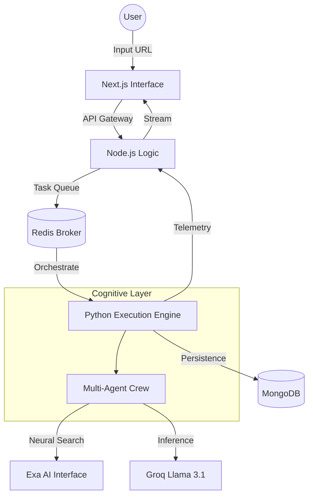

# CYBERAgent (Cybersecurity Yield Breach Evaluation & Risk Assessment)

### **Autonomous Multi-Agent Cybersecurity Intelligence Engine**

CyberAgent is a specialized intelligence platform designed to consolidate complex threat data through autonomous agentic workflows. By leveraging multi-persona cognitive orchestration, the platform automates deep-link analysis, vulnerability extraction, and risk quantification, transforming raw domain data into actionable intelligence in a single execution cycle.

---

## Core Architectural Pillars

### Domain-Isolation Guard (DIG)
A proprietary logic layer designed to enforce strict boundary conditions during intelligence gathering. By implementing neural search filtering, DIG programmatically discards off-target link data, ensuring that the generated intelligence maintains 100% fidelity to the target domain and eliminating cross-domain data leakage.

### Neural Link Analysis and Threat Extraction
Utilizing high-dimensional neural search protocols, the engine performs autonomous reconnaissance across indexed threat databases. Unlike traditional keyword-based scrapers, this system employs semantic link-analysis to identify deep-seated vulnerabilities and emerging threats.

### AEGIS Risk Quantification
A sophisticated analytical framework that derives a unified security posture from distributed threat indicators. The AEGIS model utilizes a weighted CVSS-anchored penalty logic to provide a transparent, mathematically-backed risk score, offering a granular view of the threat landscape.

---

## Architecture Overview

---

## Capability Stack

### Interface & Experience
- **Architecture**: Next.js 14 (App Router)
- **Styling**: Tailwind Utility Framework with High-Fidelity Design Tokens
- **Orchestration**: Framer Motion for sophisticated UI transitions
- **Real-time**: Bi-directional telemetry via WebSockets

### Engine & Processing
- **Execution Pipeline**: Distributed Asynchronous Task Management
- **Cognitive Framework**: Multi-persona Agentic Workflows
- **Logic Layer**: Python-based Neural Extraction and Link-Analysis
- **Data Persistence**: Scalable Document-Store for Historical Intelligence

---

## The AEGIS Scoring Model

The AEGIS model represents a shift from "black-box" AI outputs to transparent, logic-driven risk quantification. The final Risk Score is derived through a three-stage validation process:

1. **CVSS Anchor Integration**: The highest-severity vulnerability identified by the agentic crew sets the baseline score (weighted at 70% of the total potential risk).
2. **Cumulative Penalty Logic**: Secondary vulnerabilities contribute to a localized penalty pool (weighted at 30%), ensuring that multiple low-risk indicators correctly escalate the overall posture.
3. **Fidelity Verification**: Every data point is cross-referenced through the Domain-Isolation Guard to ensure 100% accuracy, filtering out noise and false positives from similar but unrelated domains.

---

## Operational Note
Due to the sensitivity of the architectural orchestration and the proprietary nature of the Domain-Isolation Guard logic, certain backend implementation details and deployment schemas are maintained in private repositories to prevent unauthorized replication of the core engine.

---

## License
This project is licensed under the MIT License - see the [LICENSE](LICENSE) file for details.

---

**CyberAgent** | *Intelligence Orchestration. Unified.*
